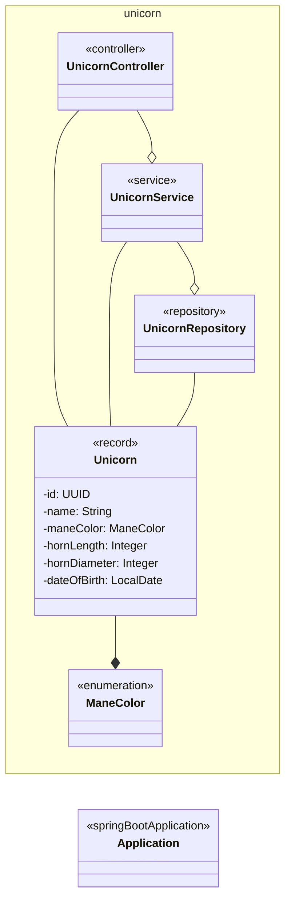

# Untangle Your Spaghetti Test Code

## Setup

1. [Login to GitHub](https://github.com/login) or [create an account](https://github.com/join).
2. If you don't have a local JDK 21 installation + an IDE:
   [create a new workspace at Gitpod](https://gitpod.io/#https://github.com/mkutz/untangle-your-spaghetti-test-code).
   This usually takes a little while, just be patient.
3. Open [ApplicationTest] from the file tree on the left. You should be able to execute the containing tests by clicking the green play button in the gutter.

## Structure

## Objectives

Feel free to use the [Cheat Sheet] for inspiration.

1. Have a look at the [ApplicationTest].

   

Brainstorm: Which problems do you see?

   - Do you understand **what's being tested**?
   - Is there a proper **arrange, act, assert structure** in the test cases?
   - Are the **names of test cases and variables** consistent?\
     Does it help to understand implications of failures?\
     Does it help to find the corresponding code?
   - Do you understand **how the test works technically**?
   - Do you see **where the test data is coming from**?
   - Which **code duplications** do you find?\
     How would you reduce them?
   - Are the [Test Code Quality Criteria](TESTCODE_QUALITY_CRITERIA.md) applied?

   

2. Ensemble: Let's untangle it!

3. Have a look at the test at [UnicornServiceTest], [UnicornControllerTest] and [UnicornTest].

   

Brainstorm: Which problems do you see?

   - Which **layer of the testing pyramid** is this test on?\
     Is the layer appropriate for the test cases?
     Can we move tests here?

     

## References

- [List of Tangles](TANGLES.md)
- [Test Code Quality Criteria](TESTCODE_QUALITY_CRITERIA.md)
- [Cheat Sheet]

[ApplicationTest]: <src/test/java/com/agiletestingdays/untangletestcode/unicornservice/ApplicationTest.java>
[UnicornControllerTest]: <src/test/java/com/agiletestingdays/untangletestcode/unicornservice/unicorn/UnicornControllerTest.java>
[UnicornServiceTest]: <src/test/java/com/agiletestingdays/untangletestcode/unicornservice/unicorn/UnicornServiceTest.java>
[UnicornTest]: <src/test/java/com/agiletestingdays/untangletestcode/unicornservice/unicorn/UnicornTest.java>
[data.sql]: <src/test/resources/data.sql>
[Cheat Sheet]: <cheat-sheet.pdf>
[Baeldung on Instancio]: <https://www.baeldung.com/java-test-data-instancio>
[Instancio]: <https://www.instancio.org/>
